# Football Player Statistics - Exploratory Data Analysis

## Overview

Let's explore performance metrics of footballers to see which players are the top performers in certain aspects. We'll also try to aggregate statistics to find the best overall-performing players.

**Check out the complementary interactive plotting dashboard with this project [HERE](https://football-stats-21-22.herokuapp.com/).**

Our dataset contains statistics from the top 5 leagues in Europe for the 2021-2022 season:
- Premier League - England
- Ligue 1 - France
- Bundesliga - Germany
- Serie A - Italy
- La Liga - Spain

To follow along, or play with the data yourself, take a look at the notebook `football_player_stats_notebook.ipynb` in this repo.

*The data used here was obtained from [Kaggle](https://www.kaggle.com/datasets/vivovinco/20212022-football-player-stats?resource=download)*

*Note that almost all stats used here are either percentage or per 90 minutes.*

## Preprocessing

There's not much required in terms of preprocessing as the dataset does not have any Null values. What we can do is shave off a bit of the data by only keeping players that played a minimum of 15 matches worth of minutes (Roughly half of a full season, 1400 minutes). The other thing we do is split the data into playing positions so we can take a look at position-specific performance metrics. There are so many feature columns in this dataset so for each position we only select a handful of relevant features.

Now we are ready to inspect the data, make some plots, and draw conclusions.

## Data Analysis

The way the data for each position is handled is pretty formulaic so I'll briefly explain the overarching methods before getting into the results.
1. For each position we grab a handful of relevant statistics from the full dataset.
2. We scale these statistics/features using `sklearn`'s `StandardScaler` for clustering and aggregating.
3. Using `sklearn`'s `KMeans` clustering method we cluster the pairs of data we are looking at at each time for better visualization.
4. Plot each pair of statistics we're interested in and draw some conclusions from the results.
5. We split the statistics into *good/positive* and *bad/negative* and do an aggregate sum of the scaled stats for each group.
6. Plot the aggregate positive vs. negative stats and draw some conclusions.

### Defenders

For defenders we're grabbing the following statistics: `Passing Accuracy`, `Tackles Won`, `Times Dribbled Past`, `Successful Pressing`, `Blocks`, `Interceptions`, `Clearances`, `Errors Leading to a Shot`, `Loose Balls Recovered`, `Aerials Won`, `Progressive Carries`, `Progressive Passes`.

#### Classical Defender

In my mind the first two things that pop up when I think of a classical defender is tackles and blocks. Let's see how the plot looks.

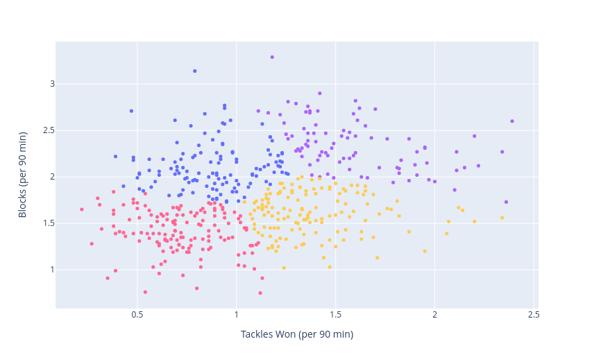

Players scoring the highest in both tackles and blocks:
- Danilo Soares (Bochum, Bundesliga)
- Petar Stojanovic (Empoli, Serie A)
- Cristian Romero (Tottenham, Premier League)

Players with considerably higher number of blocks compare to the rest:
- Kevin Akpoguma (Hoffenheim, Bundesliga)
- Charlie Taylor (Burnley, Premier League)

Interestingly, Virgil van Dijk is at the very bottom left of the plot, meaning that he has the lowest combined block and tackling numbers. However, he's a phenomenal defender and carries out his job in a different fashion by positioning himself well for interceptions and winning aerial duels. 

#### Pressing Defender

A more pressing defender would rather focus on things like interceptions and pressing. 

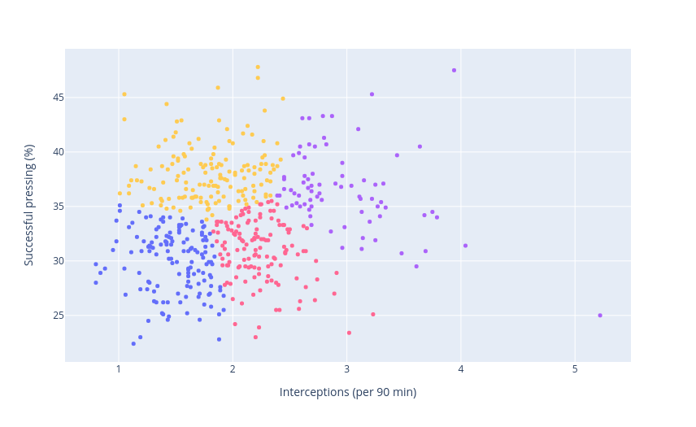

Players scoring the highest in both categories:
- Timo Hubers (Köln, Bundesliga)
- Konstantinos Mavropanos (Stuttgart, Bundesliga)
- Gleison Bremer (Torino, Serie A)

The player with by-far the highest number of interceptions is Haassane Kamara (Watford, Premier League).

#### Ball-playing Defender

Who are the defenders that like to play progressive passes and charge up the field with the ball?

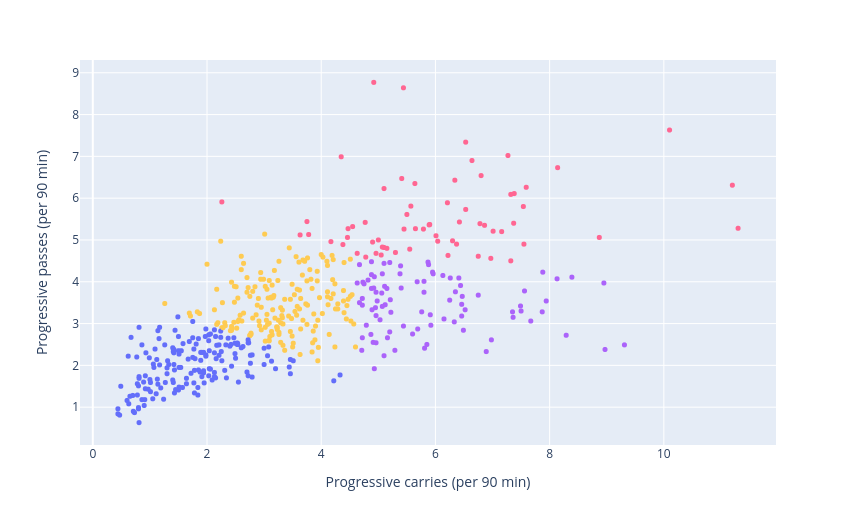

Players scoring the highest in both categories:
- Alphonso Davies (Bayern Munich, Bundesliga)
- Aymeric Laporte (Manchester City, Premier League)
- Joao Cancelo (Manchester City, Premier League)
- Joel Matip (Liverpool, Premier League)

Players with the highest amount of progressive passes:
- Trent Alexander-Arnold (Liverpool, Premier League)
- Jordi Alba (Barcelona, La Liga)

#### Error Prone

Which defenders are prone to making errors? Here we look at errors leading to shots and times they were dribbled past.

This plot came out interestingly. I was not expecting so many players to have zero errors leading to a shot. Let's take a look at the extremes for each category.

The player that has the most errors leading to a shot is Rafael Czichos (Köln, Bundesliga). Don't worry Rafael, I think you are fully capable to improve!

The player dribbled past the most luckily has zero errors leading to a shot. That player is Petar Stojanovic (Empoli, Serie A).

#### Best Overall

Let's aggregate the positive and negative features we have for the defenders. For both the positive and negative score, higher is better (i.e. low negative score: bad, high negative score: good). It's done this way so the top right of the plot is the best place to be.

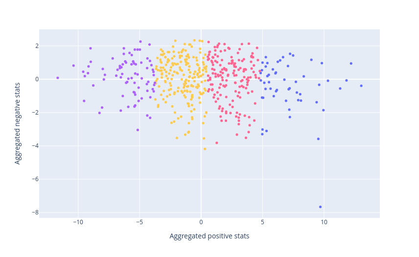

According to the aggregate score, Jose Luis Palomino (Atalanta, Serie A) is the best performing defender.

Notable players in the top performing cluster:
- Joel Matip (Liverpool, Premier League)
- Benjamin Pavard (Bayern Munich, Bundesliga)
- Niklas Sule (Bayern Munich, Bundesliga)
- Gerard Pique (Barcelona, La Liga)

### Fullback/Progressive Defenders 

There isn't a specific fullback position available in the dataset, all defenders are lumped together into one category. Therefore we'll try here to grab features more suited to fullback and progressive defenders: `Passing Accuracy`, `Times Dribbled Past`, `Successful Pressing`, `Interceptions`, `Errors Leading to a Shot`, `Progressive Carries`, `Progressive Passes`, `Passes into the Final Third`, `Carries Into the Final Third`, `Passes Leading to a Shot`, `Shot-creating Actions`, `Successful Dribbles`.

#### Progressive Passers

Who are the players with accurate and progressive passing?

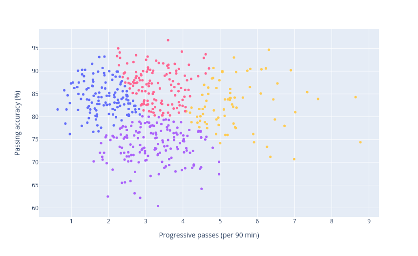

The top performing players in this category:
- Trent Alexander-Arnold (Liverpool, Premier League)
- Jordi Alba (Barcelona, La Liga)
- Joao Cancelo (Manchester City, Premier League)
- Andrew Robertson (Liverpool, Premier League)

#### Goal Threats

Passes into the final third and shot-creating actions.

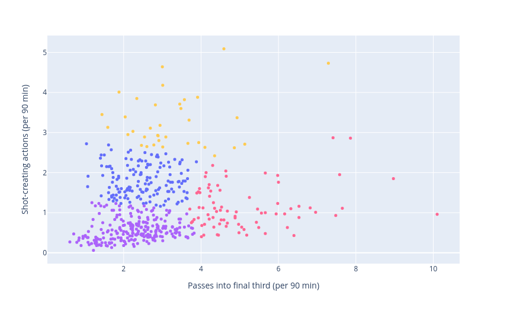

Interestingly, these two statistics seem to branch off from each other, meaning that players are either passing the ball into the final third, or making shot-creating actions. The shot-creating action players therefore seem more likely to receive the ball in the final third, while the players passing it to the final third will receive the ball further back and therefore create fewer shot-creating actions.

Players passing it the most into the final third:
- Aymeric Laporte (Manchester City, Premier League)
- Kyle Walker (Manchester City, Premier League)
- Jordi Alba (Barcelona, La Liga)
- Joao Cancelo (Manchester City, Premier League)

Players making shot-creating actions:
- Trent Alexander-Arnold (Liverpool, Premier League)
- Andrew Robertson (Liverpool, Premier League)
- Federico Dimarco (Inter, Serie A)
- Filip Kostic (Frankfurt, Bundesliga)

Here we see a clear difference between the fullbacks playing at Liverpool and Manchester City. Based on this, we can assume that City fullbacks receive the ball further back on the pitch, starting the build-up to an attack, while Liverpool fullbacks are much further up the pitch, where they deliver crosses or dribble into the opponent's penalty area.

#### Fancy-Pants

Players carrying the ball into the final third, successfully.

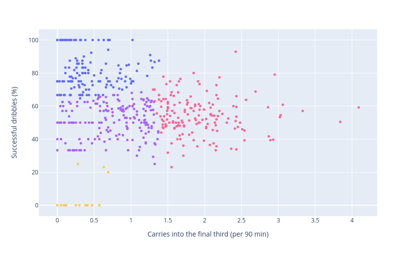

In this category, the best performing players are Alphonso Davies (Bayern Munich, Bundesliga) and Joao Cancelo (Manchester City, Premier League). Surprisingly (or not surprisingly if you've watched Liverpool play in recent years), Joel Matip (Liverpool, Premier League) has a very high successful dribble rate and plenty of carries into the final third while playing as a centre-back.

#### Best Overall

Let's aggregate the positive and negative features.

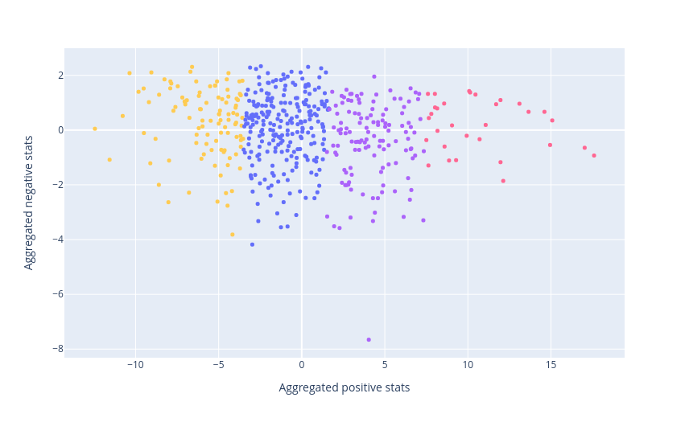

Bayern Munich, Liverpool, and Manchester City are the clear winners in this category. Their footballing philosophy clearly involves a lot of progressive actions from their defenders and fullbacks. From these teams the following players are in the top performing cluster:
- Bayern Munich
	- Alphonso Davies
	- Benjamin Pavard
	- Dayot Upamecano
	- Lucas Hernandez
	- Niklas Sule
- Liverpool
	- Trent Alexander-Arnold
	- Joel Matip
	- Andrew Robertson
- Manchester City
	- Joao Cancelo
	- Aymeric Laporte
	- Kyle Walker
	- Ruben Dias

Another notable player from the top performing cluster is Marc Cucurella (Brighton, Premier League). Chelsea clearly noticed his quality and bought him on August 5th 2022 for 65 million euros.

### Midfielders

Midfielder roles vary significantly, so we'll try to split them into three categories: defensive/deep-lying midfielders, box-to-box midfielders, and attacking midfielders.

The stats for each category is as follows.

Defensive/deep-lying midfielders: `Passing Accuracy`, `Progressive Passes`, `Tackles Won`, `Times Dribbled Past`, `Pressing Success`, `Interceptions`, `Errors Leading to a Shot`, `Failed to Gain Control of the Ball`, `Times Dispossessed`
 
Box-to-box midfielders: `Passing Accuracy`, `Long Passes`, `Passes Directly Leading to a Shot`, `Passing Into Final Third`, `Passes Into Penalty Area`, `Progressive Passes`, `Shot-creating Actions`, `Times Dribbled Past`, `Errors Leading to a Shot`, `Progressive Carries`, `Failed to Gain Control of the Ball`, `Times Dispossessed`.

Attacking midfielders: `Shot-on-target Accuracy`, `Goals per Shot`, `Passing Accuracy`, `Passes Directly Leading to a Shot`, `Passing Into Final Third`, `Shot-creating Actions`, `Errors Leading to a Shot`, `Dribble Success`, `Progressive Carries`, `Carries Into Final Third`, `Carries Into Penalty Area`, `Failed to Gain Control of the Ball`, `Times Dispossessed`, `Passes Received Accuracy`.

#### Defensively Sound Midfielders

Players that tackle and intercept the ball.

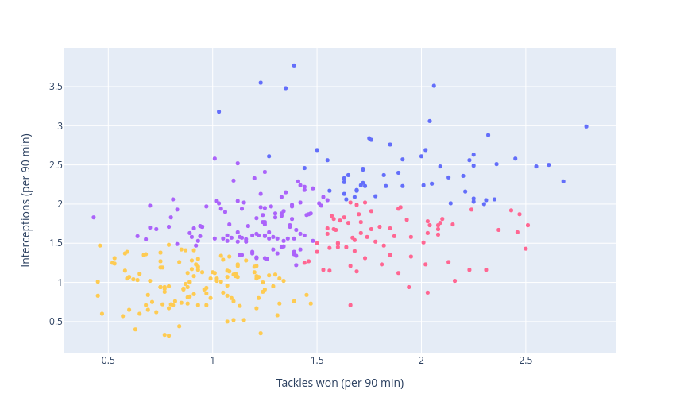

Some of the best performing players in this category:
- Jean Onana (Bordeaux, Ligue 1)
- Wilfred Ndidi (Leicester, Premier League)
- Aurelien Tchouameni (Monaco, Ligue 1)

#### Passers

Progressive and accurate passers of the ball.

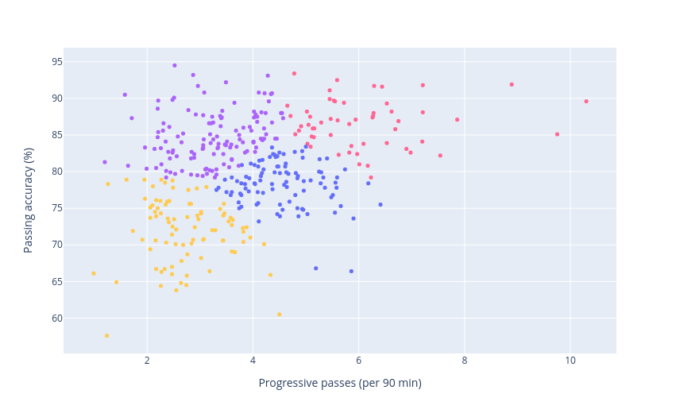

In this category there are three players that clearly stand out from the rest:
- Thiago Alcantara (Liverpool, Premier League)
- Joshua Kimmich (Bayern Munich, Bundesliga)
- Toni Kroos (Real Madrid, La Liga)

#### Penalty Box Passers

Players passing it accurately into the penalty area.

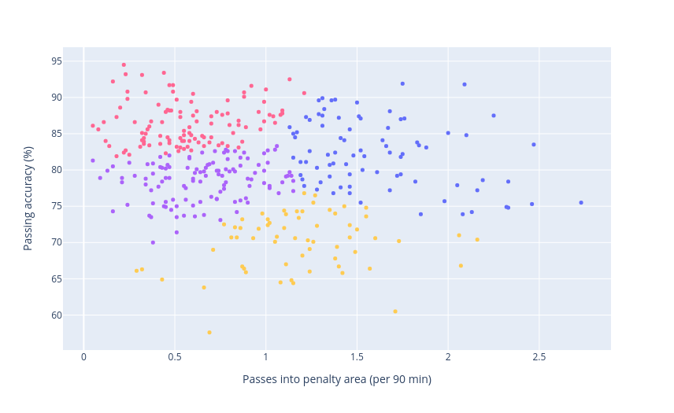

Best performing players in this category:
- Kevin De Bruyne (Manchester City, Premier League)
- Nicolo Barella (Inter, Serie A)
- David Silva (Real Sociedad, La Liga)
- Marco Verratti (PSG, Ligue 1)

To no one's surprise, Kevin De Bruyne by quite a margin leads in passing into the opponent's penalty area.

#### Progressive Carriers

Players passing into the final third and progressively carry the ball.

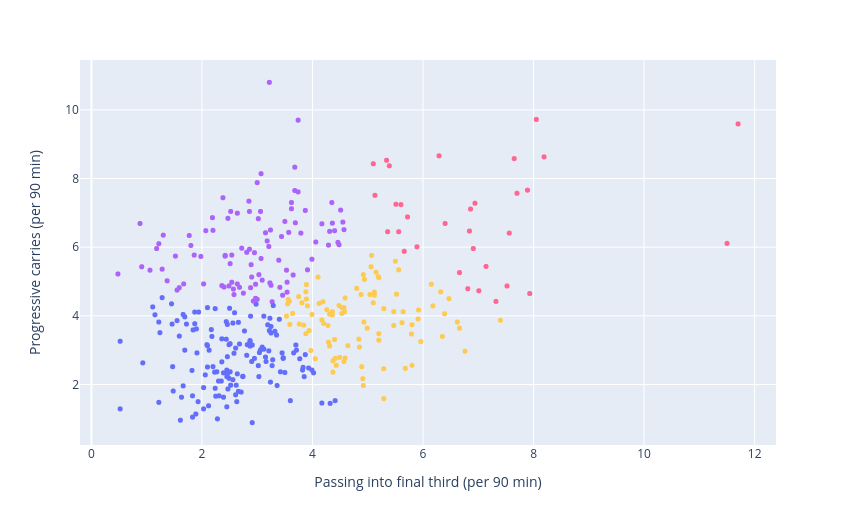

In this category there are two players in a league of their own:
- Thiago Alcantara (Liverpool, Premier League)
- Toni Kroos (Real Madrid, La Liga)

The player with the most progressive carries is Bernardo Silva (Manchester City, Premier League).

#### Carriers and Creators

Shot-creating actions and carries into opponent's penalty area.

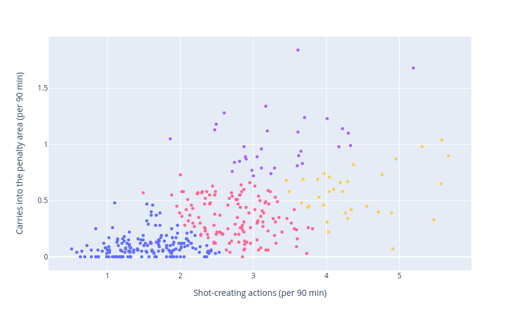

Two players are well above the rest in this category:
- Nabil Fekir (Real Betis, La Liga)
- Franck Ribery (Salerntiana, Serie A)

Kevin De Bruyne leads in shot-creating actions.

#### Reliable Dribblers

Players that successfully receive a pass and successfully dribble.

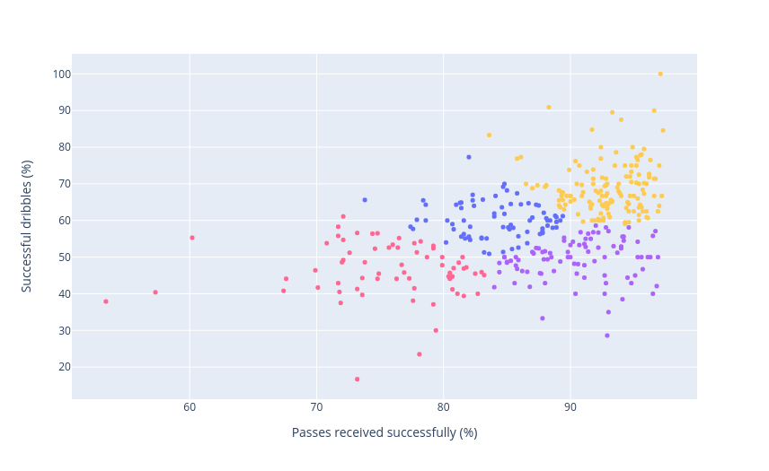

Top performing players in this category:
- Thiago Mendes (Lyon, Ligue 1)
- Sergio Busquets (Barcelona, La Liga)
- Stanislav Lobotka (Napoli, Serie A)
- Salva Sevilla (Mallorca, La Liga)
- Azor Matusiwa (Reims, Ligue 1)

#### Best Overall Defensive/Deep-lying Midfielders

Let's aggregate the positive and negative features.

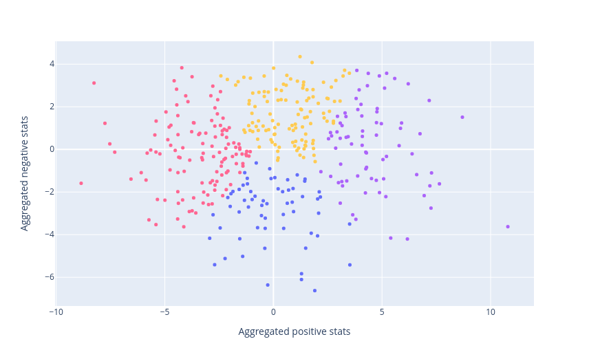

Best deep-lying/defensive midfielders based on aggregate scoring:
- Thiago Alcantara (Liverpool, Premier League)
- Aurelien Tchouameni (Monaco, Ligue 1)
- Cheick Doucoure (Lens, Ligue 1)

#### Best Overall Box-to-box Midfielders

Let's aggregate the positive and negative features.

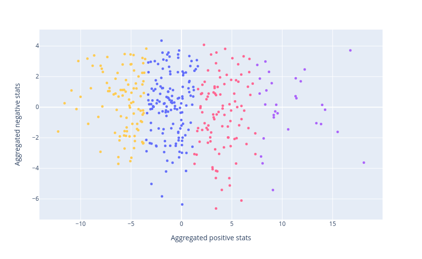

Best players in this category based on aggregate scoring:
- Toni Kroos (Real Madrid, La Liga)
- Thiago Alcantara (Liverpool, Premier League)
- Joshua Kimmich (Bayern Munich, Bundesliga)
- Marco Verratti (PSG, Ligue 1)
- Kevin De Bruyne (Manchester City, Premier League)

#### Best Overall Attacking Midfielders

Let's aggregate the positive and negative features.

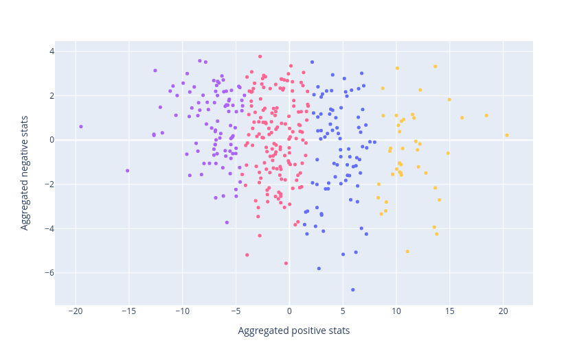

Best performing players based on aggragate score:
- Kevin De Bruyne (Manchester City, Premier League)
- Marco Verratti (PSG, Ligue 1)
- Bernardo Silva (Manchester City, Premier League)
- Luis Alberto (Lazio, Serie A)

### Forwards

Relevant features for forwards: `Shot on Target Accuracy`, `Passing Accuracy`, `Passes Leading Directly to a Shot`, `Passes Into Penalty Area`, `Shot-creating Actions`, `Tackles in Final Third`, `Pressing in Final Third`, `Interceptions`, `Errors Leading to a Shot`, `Dribble Success`, `Carries Into Penalty Area`, `Failed to Gain Control of the Ball`, `Times Dispossessed`, `Successfully Received Pass`, `Offside`, `Aerials Won`, `Touches in Penalty Area`, `Progressive Passes Received`.

#### Penalty Area Threats

Players that carry and pass the ball into the penalty area.

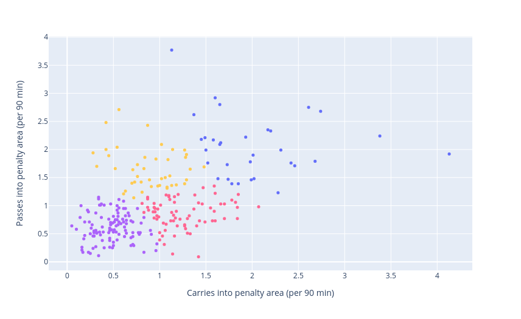

There are two players at the far extremes of each statistic. Jack Grealish (Manchester City, Premier League) leads in carries into the penalty area, and Lionel Messi (PSG, Ligue 1) leads in passes into the penalty area.

Other notably good performers are:
- Vinicius Junior (Real Madrid, La Liga)
- Ousmane Dembele (Barcelona, La Liga)
- Gerard Deluofeu (Udinese, Serie A)

#### Dribbling Chance Creators

Successful dribblers making shot-creating actions.

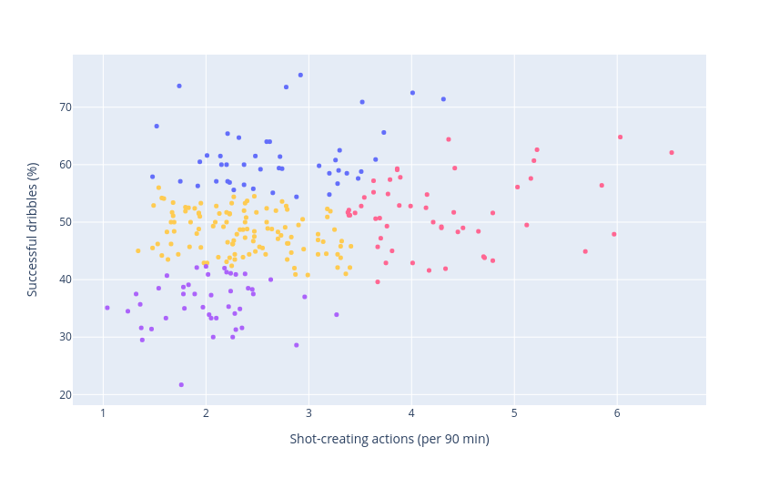

These five players lead the pack in this category:
- Dimitri Payet (Marseille, Ligue 1)
- Lionel Messi (PSG, Ligue 1)
- Luis Muriel (Atalanta, Serie A)
- Neymar (PSG, Ligue 1)
- Vinicius Junior (Real Madrid, La Liga)

#### Accurate Finishers

Goals per shot and shots on target accuracy.

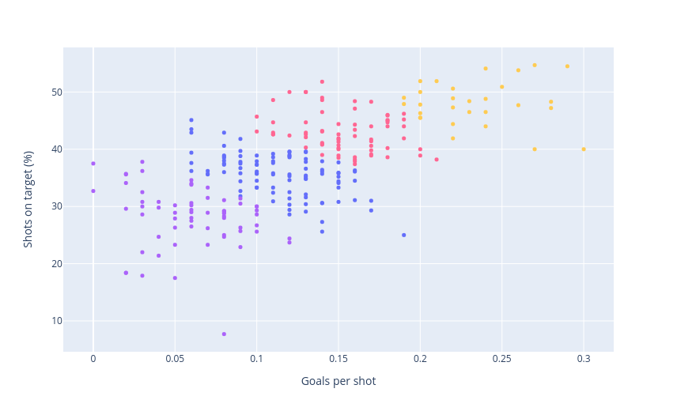

Top performing players in this category:
- Alberth Elis (Bordeaux, Ligue 1)
- Juanmi (Real Betis, La Liga)
- Son Heung-min (Tottenham, Premier League)
- Pere Milla (Elche, La Liga)
- Jamie Vardy (Leicester, Premier League)

#### Pressing Forwards

Presses and tackles in the final third.

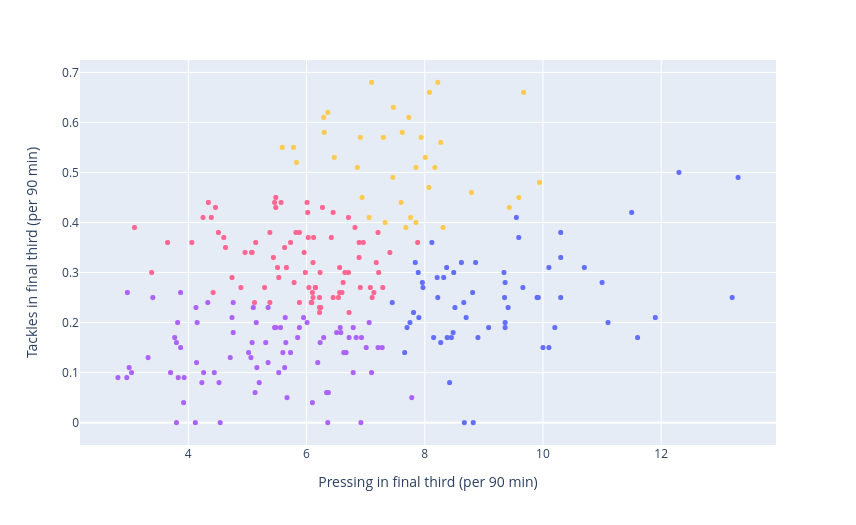

Top performing players:
- Rafael Borre (Frankfurt, Bundesliga)
- Geroginio Rutter (Hoffenheim, Bundesliga)
- Wout Weghorst (Burnley, Premier League)
- Karim Onisiwo (Mainz, Bundesliga)

#### Target Forwards

Players successfully receiving passes and winning aerial duels.

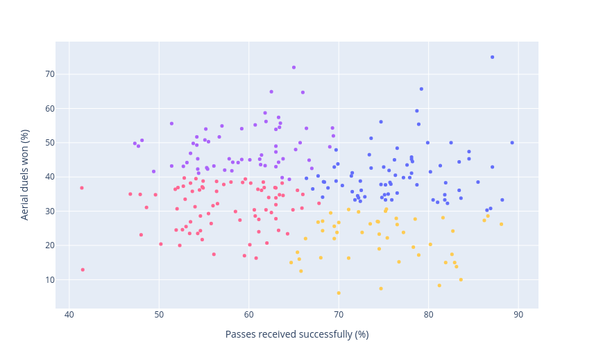

Now here's a surprising result. Lionel Messi is at the tippy-top of this category. Unsurprisingly, his passes received percentage is hig. The surprising part is that he has the highest percentage of aerials won.

Other notable performers in this category:
- Angel Di Maria (PSG, Ligue 1)
- Florian Sotoca (Lens, Ligue 1)
- Lucas Moura (Tottenham, Premier League)

#### Best Overall Forwards 

Let's aggregate the positive and negative features.

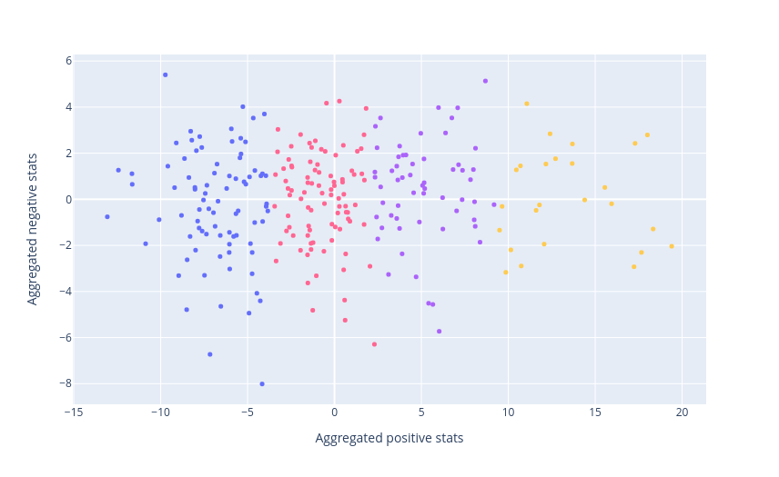

Forwards with the best aggregate score:
- Jack Grealish (Manchester City, Premier League)
- Angel Di Maria (PSG, Ligue 1)
- Riyad Mahrez (Manchester City, Premier League)
- Lionel Messi (PSG, Ligue 1)
- Serge Gnabry (Bayern Munich, Bundesliga)

### Goalkeepers

Unfortunately, there aren't many relevent statistics for goalkeepers in the dataset. If you're interested you can take a look in the `football_player_stats_notebook.ipynb` notebook at the very bottom where I try to do something useful for goalkeepers.  

## Conclusion

Determining the best players by looking at a plot of two statistics does not paint a complete picture, but it gives a pretty damn good idea of their skills if you know what to look for. Aggregating a collection of statistics is also not an exact science, as players playing in the same position can have vastly different roles within their respective teams. But again, it can give a decent idea of who the top performers might be. I for one was expecting to see Robert Lewandowski, Sadio Mane, and Virgil van Dikj popping up more as the best performers in some of the categories explored here. They will certainly show up by selecting the right combination of features. That's something you can do in the complementary interactive plotting dashboard **[here](https://football-stats-21-22.herokuapp.com/)**. 
