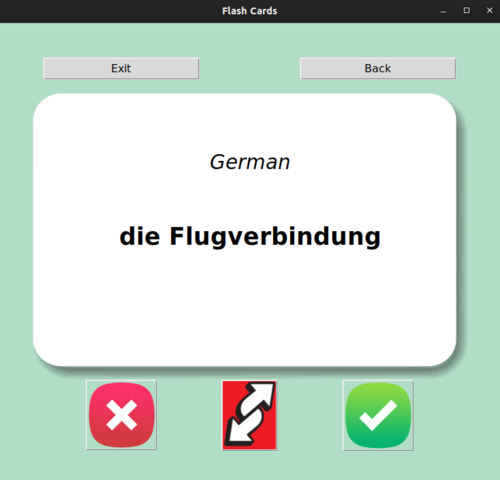
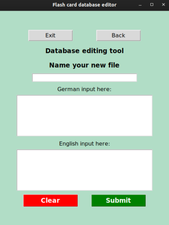

# Glossary Flash Card App

This app makes use of TKinter to create GUI flashcards to help
memorizing languages (or anything else one might write on flashcards).

`fc.py` opens up with a start screen where you choose which word
database you load up, and how many words you want to go through each time.
Once you hit start, it will take you to the 'game screen', where a word
is presented to you. 

You can flip it back and forth between translations
using the 'Uno reverse' button. If you decide you're familiar with the
word, then press the green button to move on to the next word, and this
word will be removed from your current pool of words and gets added to
a database of known words from the loaded database. By pressing the red
button a new word will appear, but the previous word will still stay in
rotation and it will appear again later. 

If you've played before, a database called `bla_known.csv` should have
been created in the `word_banks` directory, containing the words you know
from the database `bla.csv`. The next time you play and load up the `bla`
database, the app will also load up some words from the known word database
so they won't completely disappear from memory.

Currently, there is only a German/English database from B-level German.
But that's where `edit_dbs.py` comes in. There you can edit existing
databases, or create a new one from scratch. 

