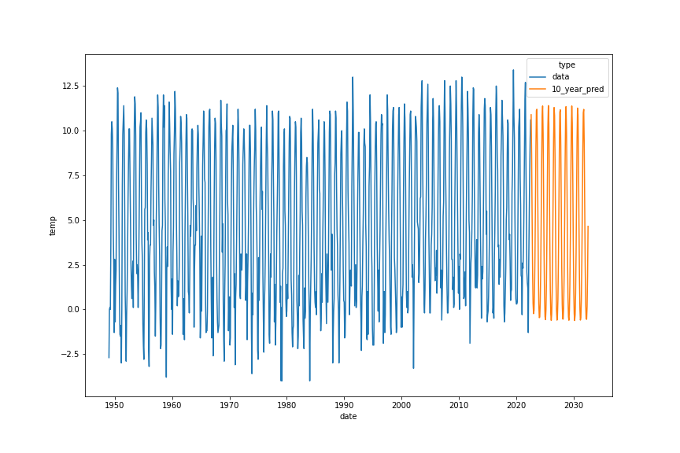

# Reykjavik temperature analysis

Let's take a look at temperature data from Reykjavik. We can find the data [here](https://en.vedur.is/climatology/data/), neatly sorted into montly time samples since 1949. In this project we'll be trying to predict the temperature in the coming months/years based on our historical data. 

We use `TimeseriesGenerator` from `Tensorflow` to generate chunks of time series to train on. We try out different neural networks to see if we get better results by adding/decreasing the model complexity and find that a simple, single-layer LSTM network is best suited for our needs. Finally we predict the temperature in Reykjavik for the next decade which is shown in the figure below.

Feel free to inspect the notebooks in this project. `simplifying_the_data.ipynb` takes the raw data and packs it neatly into a `pandas` dataframe with only the date and temperature information. `time_series_analysis.ipynb` then reads in those data and creates/trains/evaluates various models and finally plots the resulting temperature predictions. 

Unfortunately, Reykjavik will still be a cold place to be in the coming decade...

