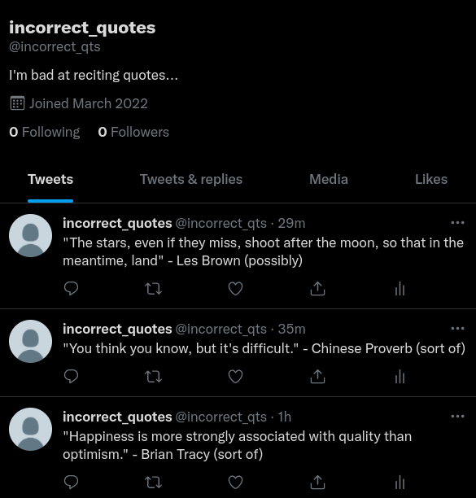

# Random Quote Twitter Bot

This bot grabs quotes from the [zenquotes.io](https://zenquotes.io)
API, scrambles up the words, sends them through a few translations
of different languages using the [DeepL](https://www.deepl.com/en)
API, and finally tweets the resulting quote using the 
[Twitter](https://twitter.com) API.

*Initially, the idea was to simply send the quote through a few
translations where the end result would be a weird, non-sensical
quote. However, the DeepL translater is pretty darn good, and no
matter how many iterations of translations I tried, it always managed
to correctly translate it through the translation chain. 
That's why I'm jumbling up the original quote before translating it.*

### Result

The bot can be found at [twitter.com/incorrect\_qts](https://twitter.com/incorrect_qts). Below is a screenshot from its twitter page.

### Breakdown

`quoter.py`, `translator.py`, and `tweeter.py` all contain the classes
required to talk to the APIs and do the jobs required. `main.py` imports
all these classes and uses their methods get the quotes, translate, and 
tweet.

To try this out yourself, you would need to sign up to DeepL and Twitter
to get the API keys. DeepL offers a free account that lets you translate
a bunch of characters (`~10^5`) every month, and twitter is of course free.
Additionally, for twitter, you need to head to 
[apps.twitter.com](https://developer.twitter.com/apps) and create an
app and make sure it has privileges to read and write by enabling
OAuth v1. Then you should have all the keys/tokens required for the
API requests. 
