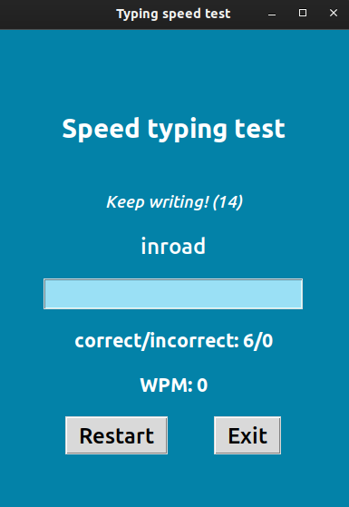

# Typing Speed Test

This app makes use of TKinter to create a GUI to test the user's
typing speed. A fairly minimalistic design, where the user simply
starts typing the word on the screen and presses spacebar to get
the next word. Once the timer (30 seconds) runs out, the app
displays the number of correctly/incorrectly typed words and the
user's words per minute. 

The words are obtained from the [random word API][https://random-word-api.herokuapp.com/home] and filtered so no words longer than 7 letters
should appear.
